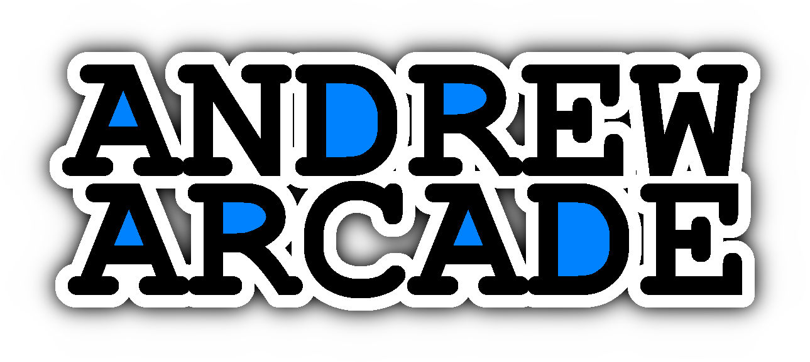

Check out my progress in the [journal](JOURNAL.md)!

<!-- ### About Andrew Arcade

Andrew Arcade is a custom game console built with a Raspberry Pi 5 running Linux. Its main purpose is to play Unity games that I have created.

Since the Raspberry Pi 5 uses an ARM processor, Unity games can't be compiled to run on it directly. To solve this, we use a tool called Box64, which lets us run Unity games and apps on the Raspberry Pi by emulating the required architecture.

### Version 2

Version 2 of Andrew Arcade will feature a redesigned case. My goal is to make it more comfortable to use and to improve some of the mounting parts that didn’t work well in the first version. -->

## About the Project

Custom game console designed to run my Unity games.

Designed on top of the Raspberry Pi 5 running pios.

We use [box64](https://github.com/ptitSeb/box64) to run Unity games on the ARM architecture. 

## Driver App

The driver app acts as the game hub, allowing you to choose which game to play. It should be configured to launch automatically at startup to provide a seamless experience.

For detailed steps on how to set up the driver app to auto-start, see [this guide](software/README.md).

## Apps
[Andrew-Arcade-Apps](https://github.com/AndrewCromar/Andrew-Arcade-Apps) (referred to as "apps repository")
> Most up to date information will be in the apps repository eventually.

### How to contribute your app

To create your own app, you'll need to submit all the source code (the full Unity project) to the apps repository. You will also need to modify the driver app to include your app (details will be provided later). Once your app is ready for release, submit a pull request (PR) to the apps repository. After your PR is approved, you can build the app and submit a second PR to this main Andrew Arcade repository.

### App file structure

Go to the [software/apps](software/apps) directory and create a new folder. Name the folder after your app using camelCase (no spaces, capitalize the first letter of each new word except for the first one). Then, place your app's build files inside the folder you just created.

### Why maintain a second repository?

Unity projects typically require a large amount of storage, while Raspberry Pi 5 devices often have limited space. As a result, the source code for the apps doesn't need to be stored directly on the device.

### More app information

For additional details about the apps or games, check out the [Andrew Arcade Apps](https://github.com/AndrewCromar/Andrew-Arcade-Apps) repository.

## Parts
> [!WARNING]
> I need to update this it is not correct atm.

- You will want an assortment of M3 screws.
- You will need to order your own pcbs (manufacturing files/instructions will come later).

| Name                  | URL                                                                                                    | Notes                                                                                                   |
|-----------------------|--------------------------------------------------------------------------------------------------------|---------------------------------------------------------------------------------------------------------|
| Raspberry Pi 5        | [link](https://www.raspberrypi.com/products/raspberry-pi-5/) | |
| Waveshare RP2040-Zero | [link](https://www.amazon.com/dp/B09L4YNNQH?ref_=cm_sw_r_cp_ud_ct_66QWR2T5E030FK6R5A1J_3&th=1) | Purchase with headers pre-soldered for easier assembly.                                                 |
| Adafruit HDMI Display | [link](https://www.adafruit.com/product/2232) | - Resolution: 800x480.  - Size: 5 inches.                                              |
| Buttons               | [link](https://www.amazon.com/dp/B08R9P3RKM?ref_=cm_sw_r_cp_ud_ct_66QWR2T5E030FK6R5A1J_6&th=1) | You need at least 11 buttons. You do not want them to be pre-wired. |
| Joysticks             | [link](https://www.adafruit.com/product/512) | Soldering is required for assembly. |
| 90 Degree Headers     | [link](https://www.amazon.com/PATIKIL-Header-Single-2-54mm-Plated/dp/B0C81QTKC5?source=ps-sl-shoppingads-lpcontext&ref_=fplfs&gQT=1&th=1) | Used to connect the joysticks to the board. |
| Button Wires          | [link](https://www.amazon.com/dp/B092CW94LK?ref_=cm_sw_r_cp_ud_ct_66QWR2T5E030FK6R5A1J_5&th=1) | You need at least 11. |
| JST Connectors        | [link](https://www.amazon.com/dp/B0B2R966ZY?ref_=cm_sw_r_cp_ud_ct_66QWR2T5E030FK6R5A1J_4&th=1) | - Size: 2P.  - Style: XH.